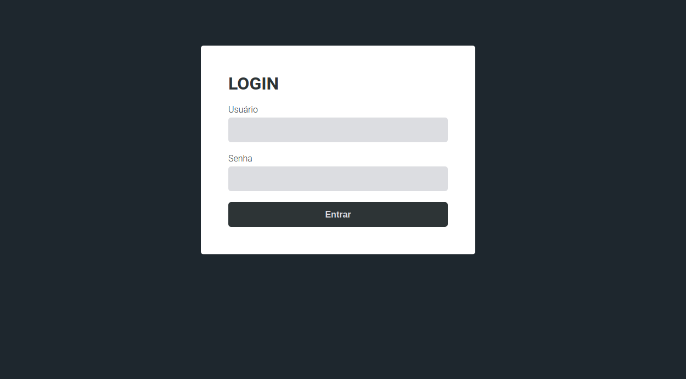
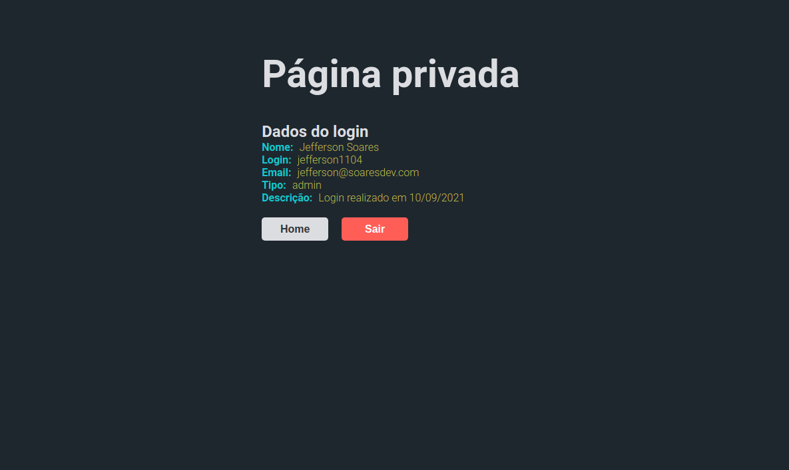

<div align="center">
  <a href="https://nextjs.org/" target="blank"></a>
  <p align="center">Autenticação de usuário utilizando Next.js e API Nest.js com JWT</p>
  <p align="center">
    
    
    
  </p>
</div>

## About this project
Authentication project with Next.js, this project serves as an example of how to authenticate sending requests to a Nest.js API with JWT (json web token), control access routes (pages) according to user login, after log in we save the token in cookies and the user has access to a protected page for 60 seconds, when this token expires the user is redirected to the login page.

## Run the project

```bash
# Clone front-end repository
$ git clone https://github.com/jefferson1104/nextjs-auth.git

# Clone API repository
$ git clone https://github.com/jefferson1104/nestjs-auth.git

# Run API project
$ cd nestjs-auth
$ code . 
$ npm run start:dev

# Run front-end project
$ cd nextjs-auth
$ code . 
$ npm run dev

# Routes
/
/login
/private

# Users
jefferson1104
123456

joel3007
123456
```

## Screenshots



